# FreelanceHub 🚀

A robust freelancing platform built with Laravel that connects freelancers with clients while ensuring secure transactions and quality service delivery.

<!--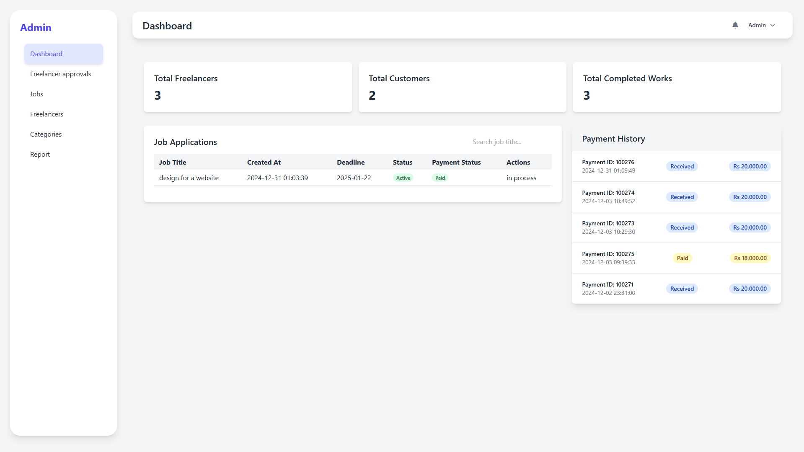-->

## 🌟 Overview

FreelanceHub is a comprehensive freelancing platform that facilitates seamless connections between freelancers and clients. The platform features a three-role system (Admin, Freelancer, Client) with distinct functionalities for each user type, ensuring a smooth and secure freelancing experience.

### 🛠️ Built With

## ✨ Key Features

### 👨‍💼 Admin Dashboard
- Account approval system for freelancers
- Job post moderation
- Payment management and security
- Dispute resolution system
- Performance tracking and ranking system

<!--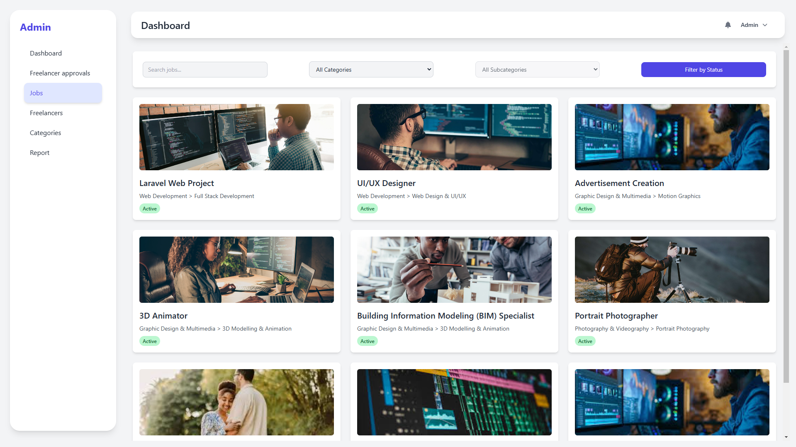
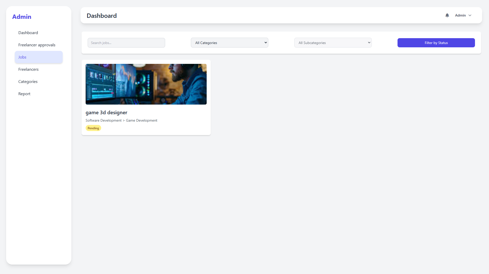-->

### 💼 Client Features
- Intuitive job browsing interface
- Secure payment processing
- Freelancer review system
- Comprehensive job history tracking

<!--
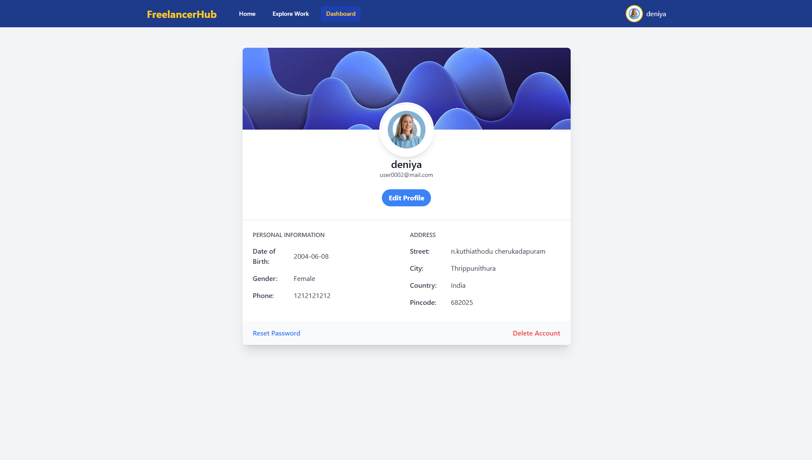
-->
### 👨‍💻 Freelancer Features
- Professional profile creation
- Job posting capabilities
- Request management system
- Performance-based ranking
- Payment tracking

<!--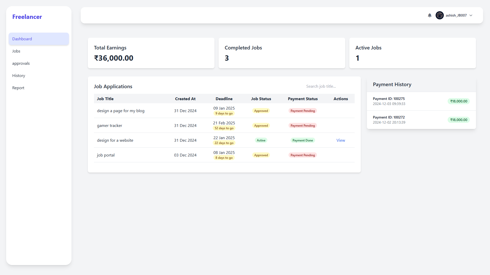
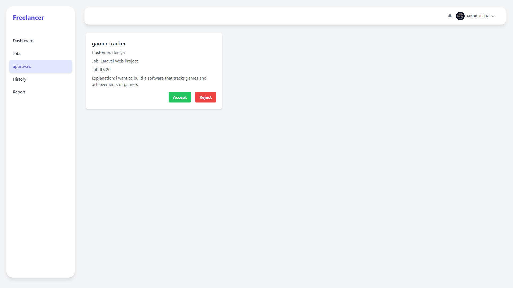-->

## 🔒 Security Features

- Secure payment holding system
- Admin-moderated transactions
- Quality assurance through approval system
- Dispute resolution mechanism
- User verification system

## 💰 Payment Workflow

1. Client initiates payment
2. Admin holds payment in escrow
3. Freelancer completes work
4. Client approves delivery
5. Admin releases payment to freelancer

<!--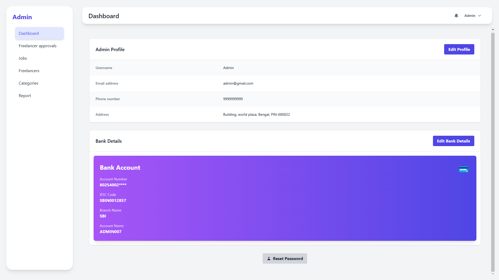-->

## 📊 User Management

### Admin Controls
<!--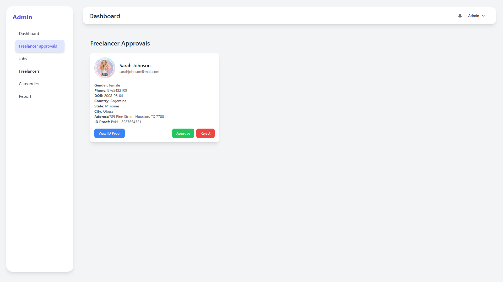-->

### Freelancer Profile
<!--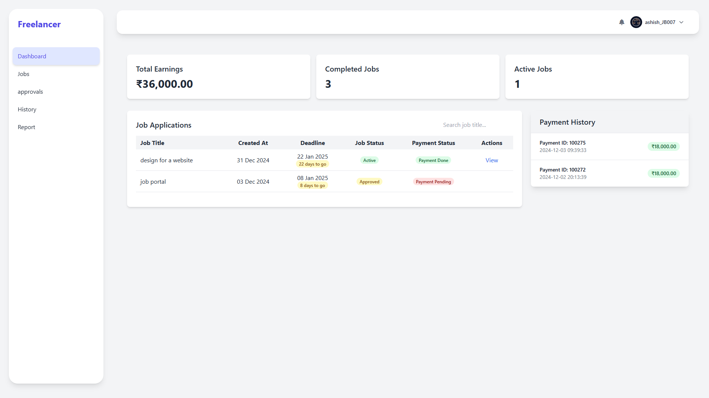-->

### Client Interface
<!---->

## 🌐 Platform Interface

The platform features a clean, intuitive interface with:
- Responsive design for all devices
- Easy navigation
- Clear status indicators
- Real-time updates
- Comprehensive dashboards

<!--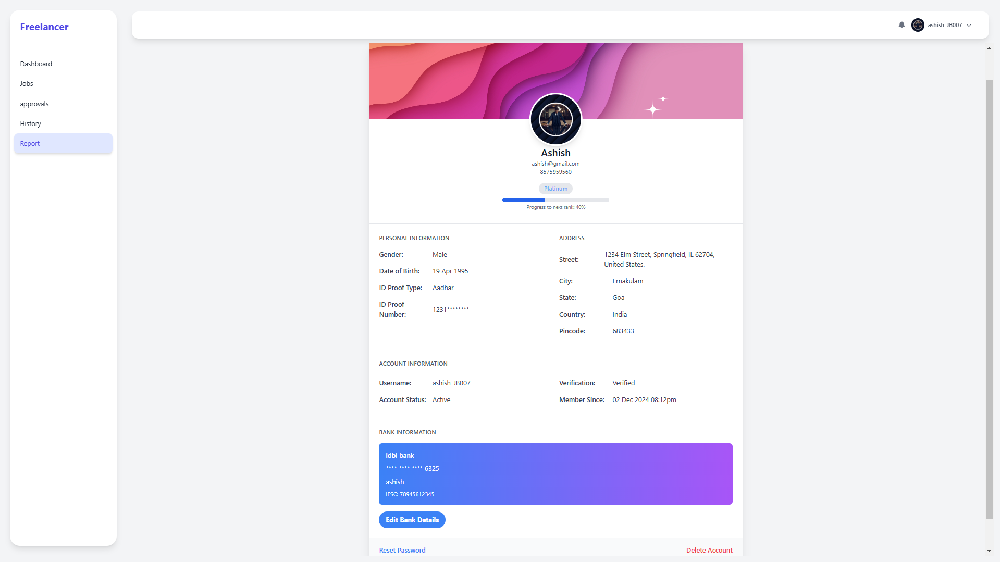-->

## 📈 Performance Tracking

- Detailed analytics for admins
- Freelancer ranking system
- Client satisfaction metrics
- Payment history tracking
- Job completion statistics

<!--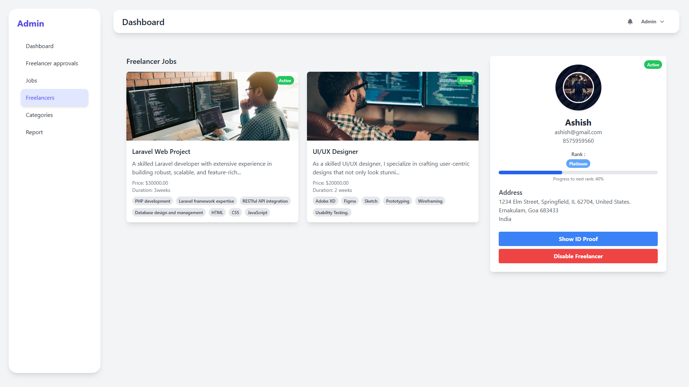-->

## 🤝 Job Management

- Streamlined job posting process
- Efficient request handling
- Clear communication channels
- Progress tracking
- Milestone management

<!--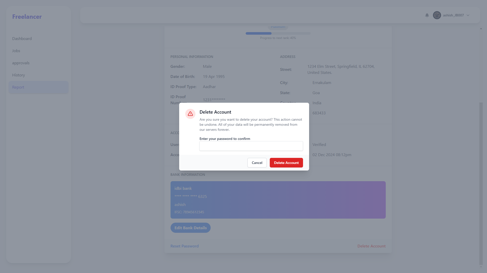-->

---

## 📋 Additional Information

This repository serves as a showcase for the FreelanceHub project. The actual source code is maintained in a private repository to ensure security and protect proprietary features.

© 2024 FreelanceHub. All Rights Reserved.
